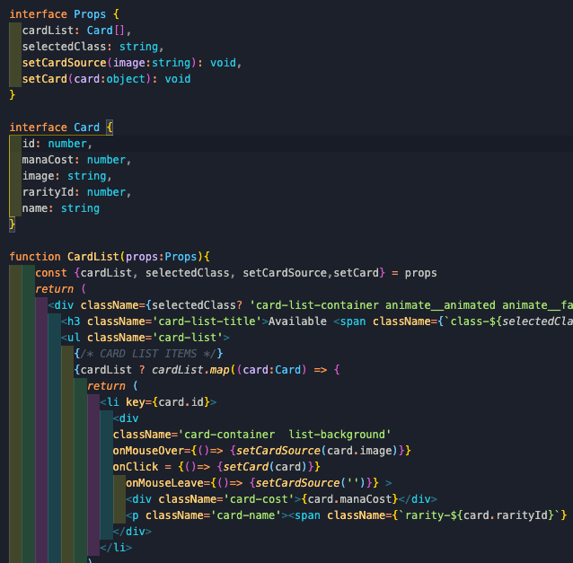

`npm run start` to run the development server

`npm run build` to create a build directory

# Hearthstone Deck Builder

**_Timeframe_**

2 Day Sprint

## 1.0 - Brief:

This application is designed as a companion to the popular card game Hearthstone and allows users to construct a variety of different decks in a simple to use interface. It is hosted on AWS Amplify and future features will make use of AWS Cognito for user authentication and Amazon DynamoDB for noSQL storage.

 The app was designed purely for desktop as future features will heavily focus on mouse actions by dragging cards around and CSS animations based on certain movements.

## 2.0 - Technologies Used

- Activision Blizzard API
- React.js
- JavaScript (ES6)
- TypeScript
- AWS Amplify
- HTML 5
- SASS/SCSS/CSS Animation
- Git/GitHub
- Axios

### Deployed version

https://master.d6di1xshwx3x0.amplifyapp.com/

## 3.0 - Code Installation

https://github.com/RobSero/Hearthstone-Deck-Builder/tree/master/hearthstone

- Clone or download the repo
- Start server with npm run start

## 4.0 - Planning

### 4.1 - Expectations

Once the initial concept was confirmed and I wanted to proceed into planning the app - Despite being a sprint, I wanted to set out clear goals, milestones and responsibilities for the remainder of the project.

I wanted to get exposure to testing third APIs but most importantly, I wanted to refine my TypeScript skills when using them in the context of React. Due to the high degree of arguments and variables in React apps from passing props, it was a practical application to apply it to.

### 4.2 - Hearthstone API

The Hearthstone API used was provided by the game developer Activision Blizzard which have a detailed set of documentation which made the actual requests quite staightforward. 

The JSON response returned was generally quite cleaned up already however there was a lot of extra bloat of data that was not neccessary for my application at this time. Potentially more of this data will become of use as future features are released for it but I used mapping to strip away a lot of the unneccessary data.

### 4.3 - API Example Requests

- Search by Class: https://us.api.blizzard.com/hearthstone/cards?locale=en_US&class=rogue

The api endpoint remained the same throughout and only one was required, the params added to the url were standard options such as quantity of cards in the response. The only variable which changed was based on the class selected which requested new data from the API on change.

## 5.0 - Development

### 5.1 - Functional Components with Hooks

The app only used functional components throughout along with hooks to manage the states which seemed like a suitable solution because there was not too many intensive operations which were required thorughout the app. I also wanted to keep my files as short as possible and DRY as possible so I tried to use syntax and hooks which I thought would achieve this.

### 5.2 - Desktop Only Application

From the start, I planned the app to be for desktop only because my intention is to continually add new mouse effects into it which seems fitting in a card game where you can drag cards about and have animations based on this.  Particularly with an app like this which have a lot of cards and requires the user to compare cards, a smaller device and vertical layout is not practical

With some adjustments to width scaling, and the flexbox settings, the app could be viewable on tablets or mobiles however many of the upcoming features will not be available and visually it just would not flow well in a vertical environment.

## 6.0 - Self Reflection
### 6.1 - Wins

- I really enjoyed getting more familiar with the power of TypeScript in a React application and it made me feel much more confident that the information I was passing around through props were correct. The syntax and use of interfaces when typing arguments was great thing to get used to. This also leads on to making a smoother transition into learning a new staticlly typed language in the future.
- I was enjoying experimenting with different animations and timers through the useEffect hook. I have found a few interesting libraries for animations and will be adding them to my library to spruce up future projects.

### 6.2  -Challenges

- TypeScript was a little tricky at first in terms of decloaring all the correct prop types as they are passed throughout the app. The small areas such as when using setState to begin as an empty object, TypeScript would throw errors as the empty object did not match the interface however it would match the interface when the state is populated with the third party data. There is still some work I need to do to better understand this but it has been an enjoyable process nonetheless.

